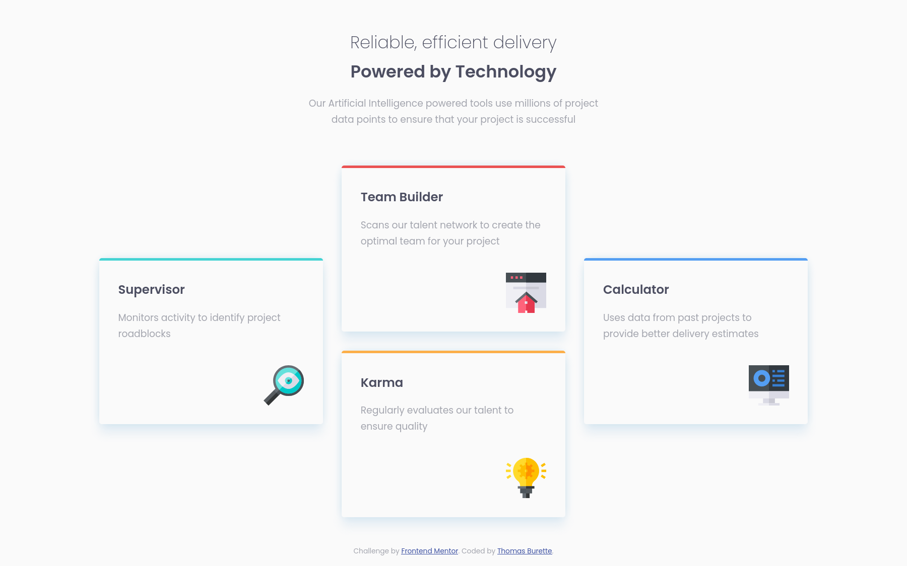

# Frontend Mentor - Four card feature section solution

This is my solution to the [Four card feature section challenge on Frontend Mentor](https://www.frontendmentor.io/challenges/four-card-feature-section-weK1eFYK). Frontend Mentor challenges help you improve your coding skills by building realistic projects. 

## Table of contents

- [Frontend Mentor - Four card feature section solution](#frontend-mentor---four-card-feature-section-solution)
  - [Table of contents](#table-of-contents)
  - [Overview](#overview)
    - [The challenge](#the-challenge)
    - [Screenshot](#screenshot)
    - [Links](#links)
  - [My process](#my-process)
    - [Built with](#built-with)
    - [Notes](#notes)
      - [Root and default font-size](#root-and-default-font-size)
      - [Not setting font-size on all header elements](#not-setting-font-size-on-all-header-elements)
      - [max-width on content instead of fluidly increasing the margin](#max-width-on-content-instead-of-fluidly-increasing-the-margin)
  - [Author](#author)

## Overview

### The challenge

Users should be able to:

- View the optimal layout for the site depending on their device's screen size

### Screenshot



### Links

- Solution URL: https://github.com/tburette/frontendmentor-four-card-feature-section
- Live Site URL: https://tburette.github.io/frontendmentor-four-card-feature-section

## My process

### Built with

- Semantic HTML5 markup
- CSS custom properties
- CSS Grid
- Mobile-first workflow

### Notes

#### Root and default font-size

Instead of setting the font-size to 15px (as mentionned in the style guide).
I used 16px*0.9375 = 15px.

```css
:root {
    font-size: 0.9375rem;
}
```

I use a value relative to rem that equals to fifteen if the default font size is
16px instead of 15px directly.  I do this to take into account the default
font size set by the user agent. It is 16px by default but user may override 
that value in browser settings.

It allows to take into account the wish of a user to have smaller/bigger text


#### Not setting font-size on all header elements

I set the font size for h3 but use default UA style for h1 h2.  
It works where I tested it but it could be a problem : a user agent could
have values that make h2 bigger than h1 or h2 for example.
A safer thing would be to define it explicitely for h1 and h2
```css
h3 {
    font-size: 1.3em;
}
```

#### max-width on content instead of fluidly increasing the margin

In the [last challenge I did](https://github.com/tburette/frontendmentor-3-column-preview-card-component). 
I used a system where the margin slowly increase as the viewport widens.

This time I just set a fixed margin. There is a maximum width for the content.
It is only when that max width is reached that the margin increase.

It is simpler at the cost of being slightly ugly when the viewport is wide but 
not wide enough to have reached the max width of the content.


## Author

- Website - [Thomas Burette](http://thomasburette.com/)
- Frontend Mentor - [@tburette](https://www.frontendmentor.io/profile/tburette)
- Twitter - [@tburette](https://twitter.com/tburette)